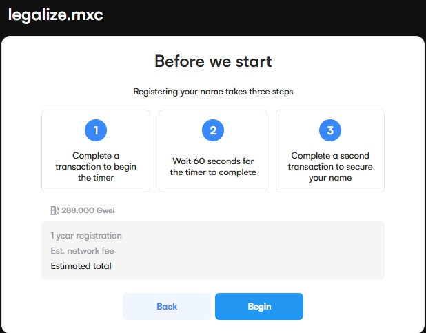
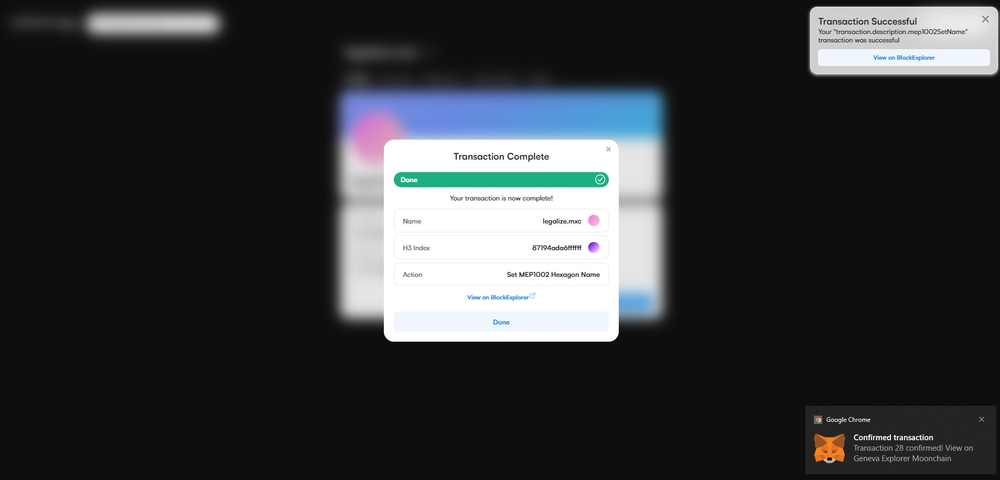
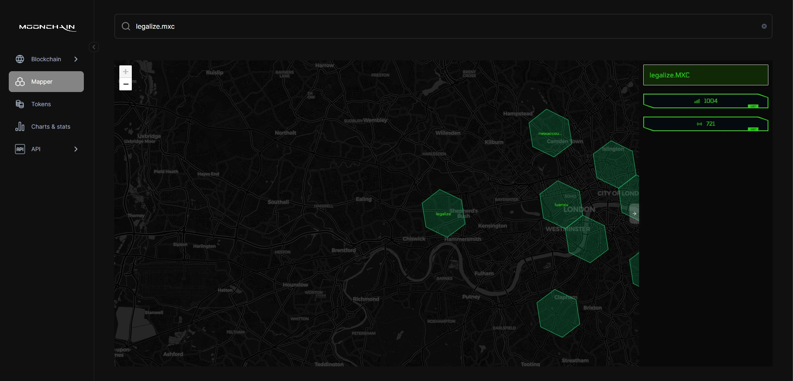

# Moonchain Domain Name und Hexagon Benennungsanleitung

Diese Anleitung hilft Ihnen, Testnet-Token für das Geneva-Testnetz vom Faucet zu erhalten, um einen Domainnamen sowie ein MNS-Hexagon zu beziehen.

> Der MXC-Token ist der Gas-Token von Moonchain (Geneva-Testnetz). Der MXC-Token wird zur Bezahlung der L2-Gasgebühr verwendet.

## Voraussetzungen

- Sie sollten bereits eine Ethereum-Wallet-Adresse haben, um die Testnet-Token zu akzeptieren. Eine Metamask-Wallet wird bevorzugt.
- Sie sollten einige MXC-Token haben, um den Moonchain-Domainnamen und die Transaktionsgebühr zu bezahlen.

### Schritte zum Erhalten eines Moonchain-Domainnamens

### 1. Fordern und erhalten Sie Ihren Geneva-Testnetz-MXC-Token
- Navigieren Sie zum [Geneva Testnet Faucet](https://geneva-faucet.moonchain.com/)
- Geben Sie Ihre Wallet-Adresse ein
- Senden Sie Geneva-Testnetz-MXC an Ihre Wallet

Sie haben erfolgreich Token auf Moonchain Geneva L2 erhalten.

### 2. Verbinden Sie Ihre Wallet
- Stellen Sie sicher, dass Ihre Wallet auf dem MXC Geneva zkEVM Testnet-Netzwerk ist.
- Navigieren Sie zur [Moonchain Geneva MNS](https://Geneva-mns.moonchain.com/).
- Klicken Sie auf die Schaltfläche "Verbinden" in der oberen rechten Ecke.
- Wählen Sie Metamask aus dem angezeigten Modal und verbinden Sie Ihre Wallet.

### 3. Suchen Sie nach einem bevorzugten Benutzernamen
- Geben Sie Ihren bevorzugten Namen in das Suchfeld ein und prüfen Sie die Verfügbarkeit.
- Wenn verfügbar, klicken Sie auf den Namen mit einem grünen "Verfügbar"-Flag daneben.

### 4. Konfigurieren Sie den Domainnamen-Kauf
- Klicken Sie auf die Plus (+)-Schaltfläche, um die Anzahl der Jahre zu erhöhen, die Sie den Domainnamen kaufen möchten.
- Schalten Sie den Schalter "Als primären Namen verwenden" ein, wenn Sie möchten, dass der Domainname als Ihr Wallet-Adressname verwendet wird.
- Klicken Sie auf die Schaltfläche "Weiter" am unteren Rand der Seite.

### 5. Überspringen Sie die Profilerstellung
- Nach dem Klicken auf "Weiter" werden Sie zur Seite "Erstellen Sie Ihr Profil" weitergeleitet.
- Klicken Sie auf die Schaltfläche "Profil überspringen".

### 6. Starten Sie die Domainregistrierung
- Klicken Sie auf die Schaltfläche "Beginnen", um die eigentliche Domainregistrierungs-Transaktion zu starten.
- Ein Modal wird angezeigt, klicken Sie auf die Schaltfläche "Wallet öffnen".
- Metamask wird angezeigt, klicken Sie auf die Schaltfläche "Bestätigen" im Metamask-Popup und warten Sie, bis die Transaktion verarbeitet ist.
- Klicken Sie auf die Schaltfläche "Fertigstellen". Schließen Sie das Modal nicht.
- Klicken Sie erneut auf die Schaltfläche "Wallet öffnen".
- Metamask wird erneut angezeigt, klicken Sie auf die Schaltfläche "Bestätigen" und warten Sie, bis die Transaktion abgeschlossen ist.
- Sobald die Transaktion abgeschlossen ist, sehen Sie eine Glückwunschseite und Ihre Wallet-Adresse wird zu Ihrem Domainnamen geändert.

Sie haben erfolgreich einen Moonchain-Domainnamen gekauft. Lassen Sie uns nun ein Hexagon damit benennen.

### Schritte zur Benennung eines Hexagons

### 1. Navigieren Sie zum Geneva ZK Explorer
- Gehen Sie zum [Geneva ZK Explorer](https://geneva-explorer.moonchain.com/).
- Auf der linken Seite der Seite sehen Sie eine vertikale Liste von Symbolen.
- Klicken Sie auf das zweite Symbol mit dem Titel "Mapper".

### 2. Erhalten Sie die Hexagon-Adresse
- Klicken Sie auf der Mapper-Seite auf einen Bereich ohne Hexagon (die grünen Hexagon-Formen).
- Beim Klicken auf die Karte sehen Sie eine hexadezimale Zahl auf der rechten Seite des Bildschirms. Diese Zahl ist der Bereichsbezeichner.
- Kopieren Sie diese hexadezimale Zahl.

### 3. Minten Sie Ihr Hexagon auf MNS
- Wechseln Sie zum Moonchain MNS und wählen Sie Ihr Konto aus.
- Unter 'Profil' klicken Sie auf die Schaltfläche "Mint MEP1002 Hexagon" und geben die hexadezimale Ziffer des zuvor ausgewählten Kartenbereichs in das Popup ein, das sich öffnet. Klicken Sie auf "Bestätigen" und genehmigen Sie die Transaktion in Ihrer Wallet. Halten Sie das Popup geöffnet, bis die Transaktion abgeschlossen ist.
- Wenn Sie in den Mapper auf Moonchain Explorer schauen, sehen Sie jetzt Ihr neu gemintetes Hexagon.

### 4. Benennen Sie Ihr Hexagon
- Nach dem bestätigten Minten Ihres Hexagons können Sie es mit einem MNS-Namen benennen.
- Klicken Sie auf die Schaltfläche "Zu MEP1002 Hexagon setzen".
- Geben Sie im Popup erneut die hexadezimale Zahl Ihres ausgewählten Kartenbereichs ein.
- Wenn Sie diese Zahl erneut benötigen, können Sie die Adresse Ihres geminteten Hexagons verwenden, um sie im [Geneva ZK Explorer](https://geneva-explorer.moonchain.com/) zu suchen.
- Die gesuchte hexadezimale Zahl ist die gemintete Token-ID, die von Dezimal in Hexadezimal umgewandelt wurde.

- Nach der Eingabe der Zahl klicken Sie auf "Bestätigen" und genehmigen Sie die Transaktion in Ihrer Wallet. Halten Sie das Popup geöffnet, bis die Transaktion abgeschlossen ist.

### 5. Bestätigen Sie, dass das Hexagon auf Ihren Domainnamen gesetzt wurde
- Navigieren Sie zum [Geneva Explorer Mapper](https://Geneva-explorer.mxc.com/mapper).
- Geben Sie im Suchfeld Ihren Domainnamen ein, z. B.: legalize.mxc.
- Sie sollten sehen: "1 übereinstimmende mns-Position gefunden".
- Drücken Sie die Eingabetaste auf Ihrer Tastatur, und Sie sehen das Hexagon, das Ihren Domainnamen hat.

Sie haben erfolgreich ein Hexagon auf Ihren Domainnamen gesetzt.
