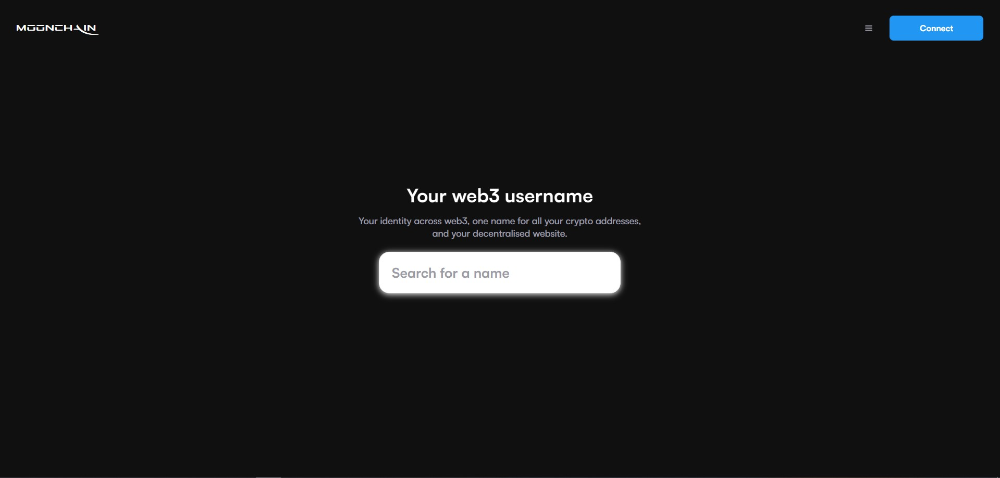
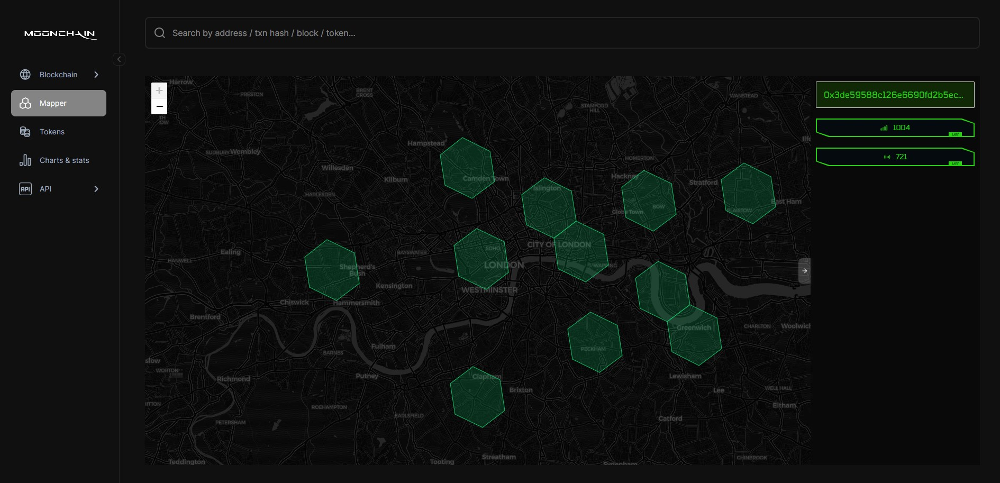

# Moonchain Domain Name and Hexagon Naming Guide

This guide will help you receive testnet tokens for Geneva testnet from the faucet to obtain a domain name as well as an MNS Hexagon.

> MXC token is the gas token of Moonchain (Geneva testnet). The MXC token is used for paying L2 gas fee.

## Prerequisites

- You should already have an Ethereum wallet address to accept the testnet tokens. Metamask wallet is preferred.
- You should have some MXC tokens to pay for Moonchain domain name and transaction fee. 

### Steps to Obtain a Moonchain Domain Name

### 1. Claim and receive your Geneva testnet MXC Token
- Navigate to the [Geneva testnet Faucet](https://geneva-faucet.moonchain.com/)
- Insert your Wallet Address
- Send Geneva testnet MXC to your Wallet

You have successfully received tokens on Moonchain Geneva L2.

### 2. Connect Your Wallet
- Ensure your wallet is on the MXC Geneva zkEVM Testnet network.
- Navigate to the [Moonchain Geneva MNS](https://Geneva-mns.moonchain.com/).
- Click the "Connect" button at the top right corner.
- Select Metamask from the modal that pops up and connect your wallet.

### 3. Search for a Preferred Username
- Type your preferred name in the search box and check for availability.
- If available, click on the name with a green "Available" flag beside it.

### 4. Configure Domain Name Purchase
- Click the plus (+) button to increase the number of years you intend to purchase the domain name for.
- Turn on the "Use as primary name" switch if you want the domain name to be used as your wallet address name.
- Click the "Next" button at the bottom of the page.

### 5. Skip Profile Creation
- After clicking "Next", you will be taken to the "Create your profile" page.
- Click the "Skip profile" button.

### 6. Start the Domain Registration
- Click the "Begin" button to start the actual domain registration transaction.
- A modal will pop up, click the "Open Wallet" button.
- Metamask will pop up, click the "Confirm" button on the Metamask popup and wait for the transaction to process.
- Click the "Finish" button. Don't close the modal.
- Click the "Open Wallet" button again the second time.
- Metamask will pop up again, click the "Confirm" button and wait for the transaction to finish processing.
- Once the transaction is complete, you will see a congratulations page, and your wallet address will change to your domain name.

You have successfully purchased a Moonchain Domain Name. Let's now name a Hexagon with it.

### Steps to Name a Hexagon

### 1. Navigate to the Geneva ZK Explorer
- Go to the [Geneva ZK Explorer](https://geneva-explorer.moonchain.com/).
- On the left-hand side of the page, you'll see a vertical list of icons.
- Click on the second icon titled "Mapper".

### 2. Get Hexagon Address
- On the Mapper page, click on any area without a Hexagon (the green Hexagon shapes).
- Upon clicking the map, you will see a hexadecimal number on the right side of the screen. This number is the area identifier.
- Copy this hexadecimal number.

### 3. Mint Your Hexagon on MNS
- Switch to the Moonchain MNS and select your account.
- Under 'Profile', click the "Mint MEP1002 Hexagon" button and enter the hexadecimal digit of the previously selected map area in the popup that opens. Click confirm and approve the transaction in your wallet. Keep the popup open until the transaction is completed. 
- When you look into the Mapper on Moonchain Explorer, you will now see your newly minted hexagon.

### 4. Set the Name of Your Hexagon
- After the confirmed mint of your Hexagon, you can name it with an MNS name.
- Click on the "Set to MEP1002 Hexagon" button.
- In the pop-up, enter the hexadecimal number of your selected map area. 
- If you need this number again, you can use the address of your minted hexagon to search for it in the [Geneva ZK Explorer](https://geneva-explorer.moonchain.com/).
- The searched hexadecimal number is the minted token id converted from decimal to hexadecimal.

- After entering the number, click confirm and approve the transaction in your wallet. Keep the popup open until the transaction is completed.

### 5. Confirm the Hexagon was Set to Your Domain Name
- Navigate to the [Geneva Explorer Mapper](https://Geneva-explorer.mxc.com/mapper).
- In the search box, type your domain name, e.g., legalize.mxc.
- You should see: "Found 1 matching mns location".
- Press enter on your keyboard, and you will see the Hexagon that has your domain name.

You have successfully set a Hexagon to your Domain Name.
